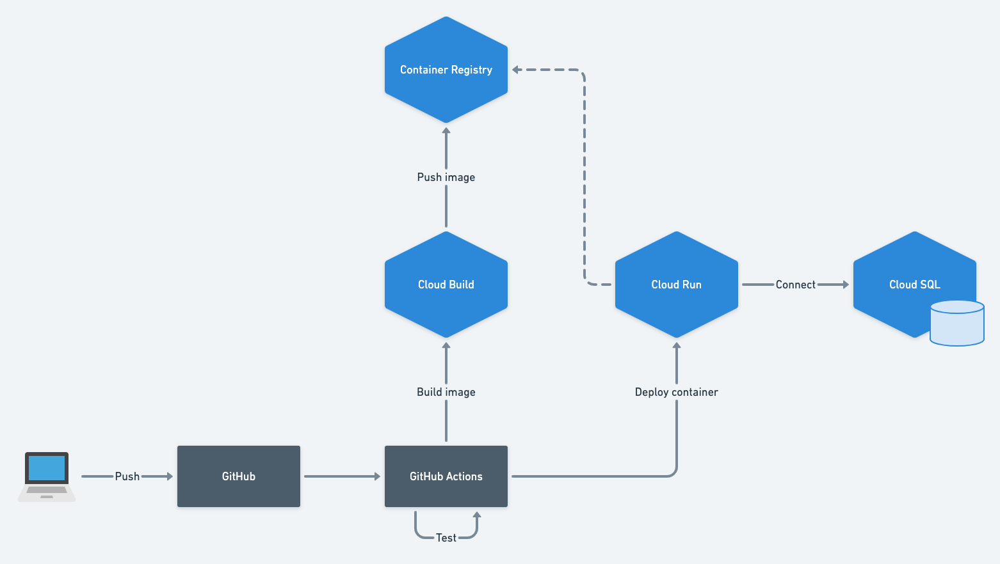

# Go TODO Sample

[](https://github.com/koizr/go-todo-sample/actions?query=workflow%3ATest)

Go で Web アプリケーション作る練習

## 本番環境

GCP の Cloud Run と Cloud SQL を使ってる。  
`v` ではじまるタグを push すると GitHub Actions でデプロイされるようになってる。



## 開発環境

### setup

環境変数を設定する。

```sh
export GOPATH="$HOME/go"
export PATH="$PATH:$GOPATH/bin"
```

ホットリロード用のパッケージをインストールする。

```sh
go get github.com/cosmtrek/air
```

プロジェクト持ってくる。

```sh
git clone git@github.com:koizr/go-todo-sample.git
```

`.env` 作る。

```sh
cp .env.template .env
```

`.env` の `SECRET_KEY` を書き換える。  
書き換える値は `openssl rand -base64 40` とかで適当に生成する。

```dotenv
SECRET_KEY=<生成した文字列>
```

### 起動

```sh
make dev
```

## テスト

### ローカルで実行

```sh
make test
```

### CI

GitHub Actions が設定されているので、 push するたびに実行される。
